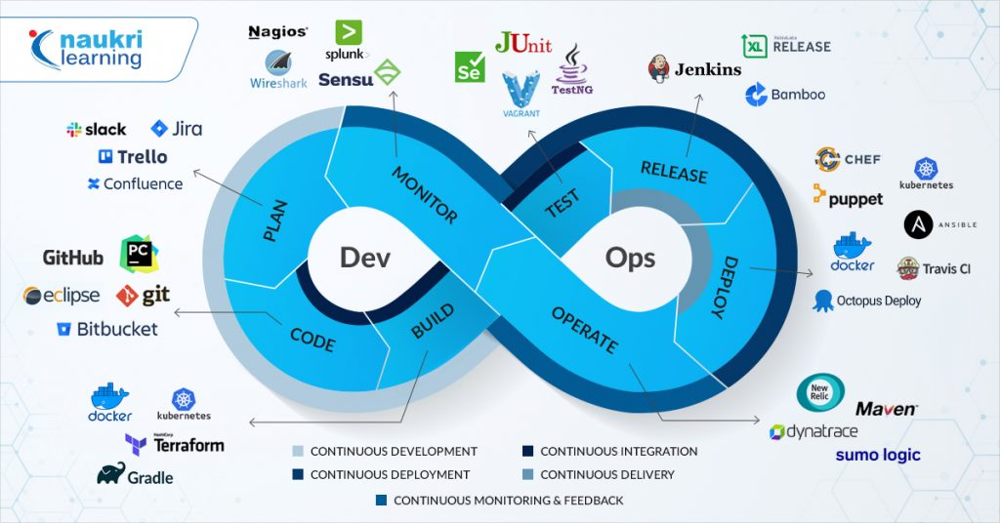

# 🚀 Curated List of DevOps Tools

---

# Your Ultimate DevOps Toolkit! 🛠️

A collection of essential DevOps tools for **development, deployment, monitoring, automation, security, and more**. Whether you're a beginner exploring DevOps or a seasoned engineer looking for the best tools, this repository has everything you need!

---

# 📌 Table of Contents
🚀 [Development Environment Tools](#Development-Environment-Tools) 
📠[Source Code Management (SCM)](#Source-Code-Management-SCM) 
⚙️ [Build Tools](#Build-Tools) 
⚡ [Continuous Integration (CI) Tools](#Continuous-Interation-(CI)-Tools) 
📦 [Artifact Management Tools](#Artifact-Management-Tools) 
🔠[Code Analysis Tools](#code-analysis-tools) 
⚡ [Continuous Delivery (CD) & GitOps Tools](Continuous-Delivery-(CD)-&-GitOps-Tools) 
🏗️ [Infrastructure Provisioning Tools](Infrastructure-Provisioning-Tools) 
🔄 [Backup & Restoration Tools](Backup-&-Restoration-Tools) 
💰 [Cloud Cost Management Tools](Cloud-Cost-Management) 
⚙️ [Configuration Management Tools](Configuration-Management-Tools) 
🔠[Secret Management Tools](Secret-Management-Tools) 
🔠[Config & Service Discovery Tools](Config-&-Service-Discovery-Tools) 
📦 [Containerization Tools](Containerization-Tools) 
🎛️ [Container Orchestration Tools](Container-Orchestration-Tools) 
🔒 [Container Security Tools](Container-Security-Tools) 
📜 [Policy Management Tools](Policy-Management-Tools) 
🔗 [Service Mesh Tools](Service-Mesh-Tools) 
📜 [Logging Tools](Logging-Tools) 
📊 [Monitoring & Observability Tools](Monitoring-&-Observability-Tools) 
📊 [Visualization Tools](Visualization-Tools) 
🏗️ [Internal Developer Platform (IDP) Tools](Internal-developer-Platform-(IDP)-Tools) 
🔗 [API Tools](API-Tools) 
🤠[Collaboration Tools](Collaboration-Tools) 
📅 [Planning & Project Management Tools](Planning-&-Project-Management-Tools) 
🖥️ [IDE (Integrated Development Environment) Tools](IDE-(Integrated-Development-Environment)-Tools) 
ğŸ [Bug & Issue Tracking Tools](Bug-&-Issue-Tracking-Tools) 
🧪 [Test Automation & Performance Testing Tools](Test-Automation-&-Performance-Testing-Tools) 
📚 [Centralized Documentation Management Tools](Centralized-Documentation-Management-Tools) 
☁️ [Cloud Provider](Cloud-Provider) 
🯠[Conclusion: Choosing the Right DevOps Tools](Conclusion-Choosing-the-Right-DevOps-Tools) 

---

# Development Environment Tools

Development environment tools **streamline the setup** of consistent software configurations, ensuring **fast recovery and higher developer productivity**.

## ⚡ Virtualization and Containerization 
🔹 [VirtualBox](https://www.virtualbox.org/) (Open Source) – Enterprise-grade virtualization for x86 and AMD64/Intel64 systems. 
🔹 [QEMU](https://www.qemu.org/) (Open Source) – Open-source machine emulator and virtualizer. 
🔹 [Vagrant](https://developer.hashicorp.com/vagrant) (Open Source) – Automates the setup and management of virtual machines. 
## 🛠️ Containerized Development 
🔹 [Docker Desktop](https://www.docker.com/products/docker-desktop/) (Open Source) – Simplifies containerized application development. 
🔹 [Podman Desktop](https://podman.io/) (Open Source) – A daemonless container engine for Linux environments. 
🔹 [Rancher Desktop](https://rancherdesktop.io/) (Open Source) – Manage and deploy Kubernetes clusters locally. 
## ☸ Kubernetes Local Clusters 
🔹 [Minikube](https://minikube.sigs.k8s.io/docs/) (Open Source) – Run Kubernetes clusters locally with ease. 
🔹 [Minishift](https://okd.io/minishift/) (Open Source) – Deploy a single-node OpenShift cluster in a VM. 
🔹 [kind](https://kind.sigs.k8s.io/) (Open Source) – Spin up Kubernetes clusters using Docker containers. 
🔹 [k3d](https://k3d.io/stable/) (Open Source) – Lightweight wrapper for running k3s in Docker. 

---

# Source Code Management (SCM)
Version control tools **keep track of every change**, making collaboration and automation seamless in DevOps.

## 🌍 Cloud-Based SCM Platforms
🔹 [GitHub](https://github.com/) (Free & Paid) – The most popular Git-based repository hosting platform. 
🔹 [Bitbucket](https://bitbucket.org/) (Free & Paid) – SCM solution by Atlassian, supports Git & Mercurial. 
🔹 [GitLab](https://about.gitlab.com/) (Free & Paid) – Complete DevOps platform with CI/CD integration. 
🔹 [Azure Repos](https://azure.microsoft.com/en-us/products/devops/repos/) (Free & Paid) – Cloud-based Git & TFVC repositories. 
🔹 [AWS CodeCommit](https://aws.amazon.com/codecommit/) (Free & Paid) – Fully-managed Git hosting by AWS. 
🔹 [Google Cloud Source Repositories](https://cloud.google.com/source-repositories/docs/) (Free & Paid) – Scalable, private Git repositories on Google Cloud. 

## 🔧 Self-Hosted & Open-Source SCM
🔹 [Codeberg](https://codeberg.org/) (Free & Paid) – Community-driven Forgejo instance. 
🔹 [Forgejo](https://forgejo.org/) (Open Source) – Self-hosted Git service, a Gitea fork. 
🔹 [Fossil](https://fossil-scm.org/home/doc/trunk/www/index.wiki) (Free) – SCM with a built-in wiki & issue tracker. 
🔹 [Gitea](https://about.gitea.com/) (Open Source) – Lightweight self-hosted Git service. 
🔹 [Gogs](https://gogs.io/) (Open Source) – Simple, self-hosted Git repository system. 

---

# ⚙️ Build Tools

Build tools automate software compilation and **generate deployable artifacts** efficiently.

## ☕ Java & JVM-Based Builds
🔹 [Maven](https://maven.apache.org/) (Java) (Open Source) – A comprehensive project management and build tool. 
🔹 [Gradle](https://gradle.org/) (Java, Kotlin, Groovy, Scala, Python, C++) (Free & Paid) – High-performance build automation. 

## 📦 JavaScript & Web Development
🔹 [npm](https://www.npmjs.com/) (JavaScript) – The package manager for Node.js applications. 

## 💎 Ruby & .NET Build Systems
🔹 [Rake](https://ruby.github.io/rake/) (Ruby) (Open Source) – Task management and build automation for Ruby projects. 
🔹 [MSBuild](https://github.com/dotnet/msbuild) (.NET) (Open Source) – The official build system for **.NET applications**. 

## 🐍 Python Build Tools
🔹 [Pybuilder](https://pybuilder.io/) (Python) (Open Source) – A lightweight tool for Python project automation. 

---

# ⚡ Continuous Integration (CI) Tools

Continuous Integration (CI) automates code integrations, providing **instant feedback** on changes. This helps teams **detect and resolve issues faster**, reducing software release cycles.

## 🚀 Popular CI/CD Platforms
🔹 [Jenkins](https://www.jenkins.io/) (Open Source) – Java-based automation server with Groovy-based pipeline support. 
🔹 [GitHub Actions](https://github.com/features/actions) (Free & Enterprise) – Built-in CI/CD for GitHub repositories. 
🔹 [GitLab CI/CD](https://docs.gitlab.com/ci/) (Free & Enterprise) – YAML-based pipelines, cloud and self-hosted. 
🔹 [CircleCI](https://circleci.com/) (Free & Paid) – Cloud-based CI/CD, YAML-configured workflows. 
🔹 [Drone](https://www.drone.io/) (Free & Paid) – Container-first CI/CD, self-hosted or cloud-based. 

## 🏗️ Enterprise & Commercial Solutions
🔹 [TeamCity](https://www.jetbrains.com/teamcity/) (Free & Enterprise) – JetBrains' powerful CI/CD tool. 
🔹 [Travis CI](https://www.travis-ci.com/) (Open Source) – Cloud-native CI for GitHub repositories. 
🔹 [Bamboo](https://www.atlassian.com/software/bamboo) (Free & Enterprise) – Atlassian's CI/CD solution with tight Jira integration. 
🔹 [RazorOps CICD](https://razorops.com/) (Free & Paid) – Container-first CI/CD SaaS and on-premises solutions. 
🔹 [Buildkite](https://buildkite.com/) (Free & Paid) – Self-hosted CI/CD with scalable build agents. 

---

# 📦 Artifact Management Tools

Artifact management tools store and version **compiled binaries and dependencies**, ensuring consistency across deployments.

🔹 [Nexus](https://www.sonatype.com/products/nexus-community-edition-download) (Free & Enterprise) – Universal repository manager supporting multiple formats. 
🔹 [JFrog Artifactory](https://jfrog.com/artifactory/) (Enterprise) – End-to-end binary and artifact management solution. 
🔹 [npm](https://www.npmjs.com/) (Free) – JavaScript package manager for dependency management. 
🔹 [NuGet](https://www.nuget.org/) (.NET) (Free) – Package manager for .NET libraries and applications. 

---

# 🔠Code Analysis Tools 
Code analysis tools identify bugs, security flaws, and code quality issues before deployment, helping developers improve software reliability. 

## 🛡 Types of Code Analysis
✔ Static Analysis (SAST) – Scans source code without executing it to detect vulnerabilities and bad practices. 
✔ Dynamic Analysis (DAST) – Runs the application to uncover performance bottlenecks and security flaws. 

## 📊 Top Code Analysis Tools
🔹 [SonarQube](https://www.sonarsource.com/products/sonarqube/) (Free & Enterprise) – Automates static code reviews to detect bugs, security issues, and code smells. 
🔹 [Checkmarx](https://checkmarx.com/) (Enterprise) – Advanced SAST tool for identifying security vulnerabilities. 
🔹 [PMD](https://pmd.github.io/) (Open Source) – Multi-language static code analyzer for detecting common programming mistakes. 
🔹 [Acunetix](https://www.acunetix.com/) (Enterprise) – DAST web vulnerability scanner that autonomously detects security risks. 

---

# ⚡ Continuous Delivery (CD) & GitOps Tools
Continuous Delivery (CD) ensures that software can be reliably deployed at any time, enabling frequent releases with minimal risk. GitOps, a subset of DevOps, leverages Git as a single source of truth to manage declarative infrastructure and applications. 

## 🚀 Popular Continuous Delivery & GitOps Tools
🔹 [Jenkins](https://www.jenkins.io/) (Open Source) – Industry-leading automation server for building, deploying, and automating CI/CD workflows. 
🔹 [Argo CD](https://argo-cd.readthedocs.io/en/stable/) (Open Source) – GitOps-driven CD tool for Kubernetes with declarative deployments. 
🔹 [Flux CD](https://fluxcd.io/) (Open Source) – Automates container deployments to Kubernetes using GitOps principles. 
🔹 [Go CD](https://www.gocd.org/) (Open Source) – Workflow visualization for modeling and executing complex delivery pipelines. 
🔹 [GitLab CD](https://docs.gitlab.com/ci/) (Free & Enterprise) – Integrated CD solution within GitLab for automated deployment and monitoring. 
🔹 [Weave GitOps](https://www.weave.works/oss/gitops/) (Enterprise) – Enterprise-grade GitOps framework for managing applications and infrastructure. 
🔹 [Jenkins X](https://jenkins-x.io/) (Open Source) – Kubernetes-native automated CI/CD with preview environments. 
🔹 [Tekton](https://tekton.dev/) (Open Source) – Flexible CI/CD framework for cloud-native continuous delivery workflows. 

---

# 🏗️ Infrastructure Provisioning Tools
Infrastructure provisioning tools automate the setup and management of cloud and on-premises resources, ensuring scalability, consistency, and efficiency in deployments.

## 🌍 Top Infrastructure-as-Code (IaC) Tools
🔹 [Terraform](https://developer.hashicorp.com/terraform) (Open Source & Enterprise) – Declarative infrastructure as code (IaC) tool supporting multiple cloud providers. 
🔹 [Pulumi](https://www.pulumi.com/) (Open Source & Enterprise) – IaC tool using familiar programming languages (Python, Go, JavaScript, etc.). 
🔹 [AWS CloudFormation](https://aws.amazon.com/cloudformation/) (AWS Service) – Native AWS IaC solution for defining and provisioning AWS resources. 
🔹 [Azure Resource Manager (ARM)](https://learn.microsoft.com/en-us/azure/azure-resource-manager/management/overview) (Azure Service) – Native Azure IaC tool for managing resources declaratively. 
🔹 [Azure Bicep](https://learn.microsoft.com/en-us/azure/azure-resource-manager/bicep/) (Azure Service) – Simplified ARM template alternative with a cleaner syntax for managing Azure resources. 

---

# 🔄 Backup & Restoration Tools
Backup and restoration tools ensure data protection, disaster recovery, and business continuity by securely backing up and restoring applications and infrastructure.

## 🔥 Best Tools for Backup & Disaster Recovery
🔹 [Velero](https://velero.io/) (Open Source) – Backup & restore Kubernetes clusters, perform disaster recovery, and migrate persistent volumes. 
🔹 [Kasten K10](https://www.veeam.com/products/cloud/kubernetes-data-protection.html) (Free & Enterprise) – Enterprise-grade Kubernetes backup & recovery platform with robust automation. 
🔹 [CloudCasa](https://cloudcasa.io/) (Free & Enterprise) – Cloud-native Kubernetes backup & disaster recovery with automated workflows. 

---

# 💰 Cloud Cost Management Tools
Cloud cost management tools help organizations monitor, analyze, and optimize cloud spending, ensuring cost efficiency while maintaining performance.

## 📊 Best Cloud Cost Optimization Tools
🔹 [InfraCost](https://www.infracost.io/) (Open Source) – Cost estimation for Terraform, providing real-time insights into infrastructure expenses. 
🔹 [Kubecost](https://www.apptio.com/products/kubecost/?src=kc-com) (Open Source) – Kubernetes cost visibility & optimization, helping monitor cluster spending and resource allocation. 

---

# ⚙️ Configuration Management Tools
Configuration management tools automate server and application configurations, ensuring consistency, reliability, and repeatability across environments.

## 🔥 Top Configuration Management Tools
🔹 [Ansible](https://www.redhat.com/en/ansible-collaborative?intcmp=7015Y000003t7aWQAQ) (Open Source & Enterprise) – Agentless automation for configuration management, application deployment, and IT orchestration. 
🔹 [Chef](https://www.chef.io/) (Open Source & Enterprise) – Automates infrastructure by defining it as code, ensuring consistent deployment across environments. 
🔹 [Puppet](https://www.puppet.com/) (Open Source & Enterprise) – Declarative infrastructure automation for configuration management across Unix & Windows. 
🔹 [SaltStack](https://www.saltstack.com/) (Open Source & Enterprise) – Scalable remote execution and automation for managing and securing infrastructure. 

---

# 🔐 Secret Management Tools
Secret management tools secure sensitive data such as API keys, passwords, certificates, and tokens, ensuring controlled access and encryption.

## 🛡️ Best Tools for Secure Secret Management
🔹 [HashiCorp Vault](https://developer.hashicorp.com/vault) (Open Source & Enterprise) – Securely stores and manages secrets with tight access controls and auditing. 
🔹 [External Secrets Operator](https://github.com/external-secrets/kubernetes-external-secrets) (Open Source) – Integrates Kubernetes with cloud-based secret stores for secure management. 
🔹 [AWS Secrets Manager](https://aws.amazon.com/secrets-manager/) – Fully managed AWS secret storage, allowing secure access to credentials and API keys. 
🔹 [Google Cloud Secret Manager](https://cloud.google.com/secret-manager/docs) – Google Cloud’s secure vault for storing API keys, passwords, and certificates. 
🔹 [Azure Key Vault](https://azure.microsoft.com/en-us/products/key-vault/) – Microsoft Azure’s solution for managing cryptographic keys, secrets, and certificates. 
🔹 [Teller](https://tlr.dev/) (Open Source) – Developer-friendly secret management tool supporting multi-cloud applications and secure storage. 

---

# 🔎 Config & Service Discovery Tools
Config and service discovery tools help distributed applications manage configuration data dynamically and locate services without hardcoded dependencies.

## ⚡ Best Tools for Config & Service Discovery
🔹 [Consul](https://developer.hashicorp.com/consul) (Open Source & Enterprise) – Service discovery, health checks, and key-value storage for highly scalable applications. 
🔹 [Etcd](https://etcd.io/) (Open Source) – Highly available key-value store used for distributed systems and Kubernetes configurations. 
🔹 [Apache ZooKeeper](https://zookeeper.apache.org/) (Open Source) – Centralized service registry for distributed synchronization, configuration management, and naming services. 
🔹 [Eureka](https://github.com/Netflix/eureka) (Open Source) – Netflix’s service registry for microservices discovery and failover handling. 

---
